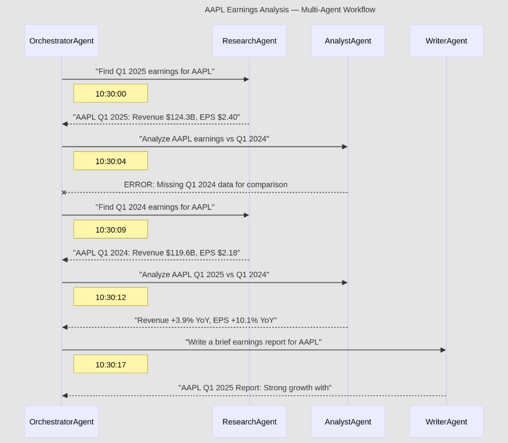
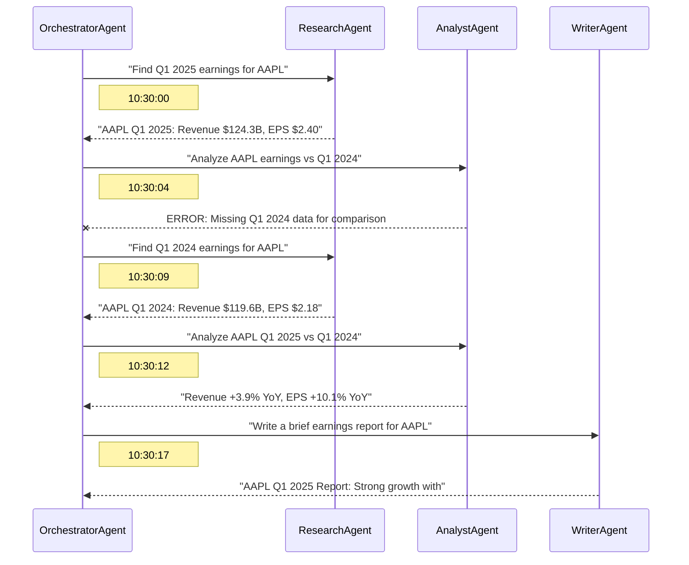

# A2A-Mermaid-Tracer

[](https://github.com/matthieu-music/a2a-mermaid-tracer/actions/workflows/ci.yml)
[](https://pypi.org/project/a2a-mermaid-tracer/)
[](https://www.python.org/downloads/)
[](LICENSE)

CLI tool to generate [Mermaid.js](https://mermaid.js.org/) sequence diagrams from [A2A (Agent2Agent) protocol](https://a2a-protocol.org/) communication traces.

Visualize multi-agent interactions at a glance.



## Features

- Parse JSON-RPC 2.0 trace logs (JSON array or NDJSON format)
- Generate Mermaid sequence diagrams with:
  - Request arrows (solid)
  - Response arrows (dashed)
  - Error indicators (cross arrows)
  - Timestamp annotations
  - Task ID references
  - Task grouping (`--group-by-task` for rect blocks)
- Output to stdout or file (`.md` with code block, or raw `.mmd`)
- Stdin support (`--input -`) for pipeline usage
- Strict mode (`--strict`) to fail on malformed entries

## Installation

```bash
pip install a2a-mermaid-tracer
```

Or for development:

```bash
git clone https://github.com/matthieu-music/a2a-mermaid-tracer.git
cd a2a-mermaid-tracer
pip install -e ".[dev]"
```

## Quick Start

```bash
# From a file
a2a-mermaid-tracer generate --input traces.json --output diagram.md

# From stdin
cat traces.json | a2a-mermaid-tracer generate --input - --title "My Agents"

# With task grouping
a2a-mermaid-tracer generate --input traces.json --group-by-task

# Strict mode (fail on bad entries)
a2a-mermaid-tracer generate --input traces.json --strict
```

### Example output



## CLI Reference

```
Usage: a2a-mermaid-tracer generate [OPTIONS]

Options:
  -i, --input PATH       Path to trace file (JSON array or NDJSON). Use '-' for stdin.  [required]
  -o, --output PATH      Path to write the Mermaid diagram (default: stdout)
  -t, --title TEXT       Optional title for the diagram
  --strict               Fail on malformed entries instead of skipping them
  --group-by-task        Group interactions by task ID in rect blocks
  --help                 Show this message and exit.
```

## Trace format

The input file should contain JSON-RPC 2.0 messages with sender/receiver metadata:

```json
[
  {
    "sender": "AgentA",
    "receiver": "AgentB",
    "timestamp": "2025-06-15T10:30:00Z",
    "message": {
      "jsonrpc": "2.0",
      "id": "req-001",
      "method": "message/send",
      "params": { ... }
    }
  }
]
```

NDJSON (one JSON object per line) is also supported — see `examples/sample_traces.ndjson`.

## Development

```bash
pip install -e ".[dev]"
ruff check src/ tests/
ruff format src/ tests/
pytest
```

## License

MIT
