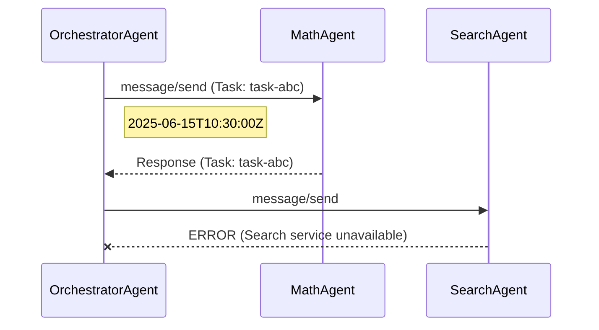

# A2A-Mermaid-Tracer

CLI tool to generate [Mermaid.js](https://mermaid.js.org/) sequence diagrams from [A2A (Agent2Agent) protocol](https://a2a-protocol.org/) communication traces.

Visualize multi-agent interactions at a glance.

## Features

- Parse JSON-RPC 2.0 trace logs (JSON array or NDJSON format)
- Generate Mermaid sequence diagrams with:
  - Request arrows (solid)
  - Response arrows (dashed)
  - Error indicators (cross arrows)
  - Timestamp annotations
  - Task ID references
- Output to stdout or file (`.md` with code block, or raw `.mmd`)

## Installation

```bash
pip install a2a-mermaid-tracer
```

Or for development:

```bash
git clone https://github.com/matthieu-music/a2a-mermaid-tracer.git
cd a2a-mermaid-tracer
pip install -e ".[dev]"
```

## Quick Start

```bash
a2a-mermaid-tracer generate --input traces.json --output diagram.md
```

### Example output



## Trace format

The input file should contain JSON-RPC 2.0 messages with sender/receiver metadata:

```json
[
  {
    "sender": "AgentA",
    "receiver": "AgentB",
    "timestamp": "2025-06-15T10:30:00Z",
    "message": {
      "jsonrpc": "2.0",
      "id": "req-001",
      "method": "message/send",
      "params": { ... }
    }
  }
]
```

NDJSON (one JSON object per line) is also supported.

## Development

```bash
pip install -e ".[dev]"
pytest
```

## License

MIT
